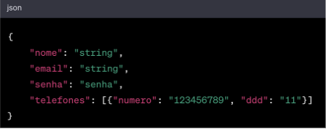
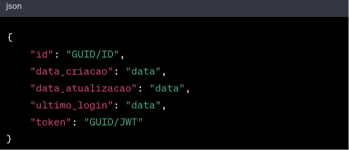
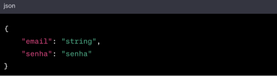
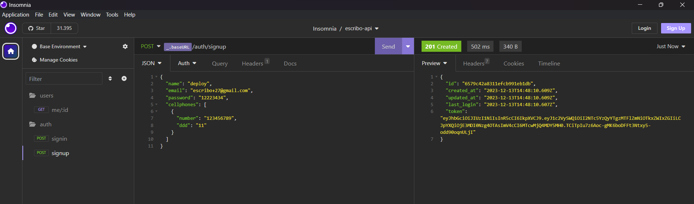
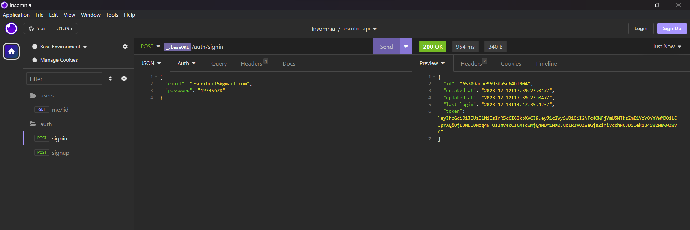
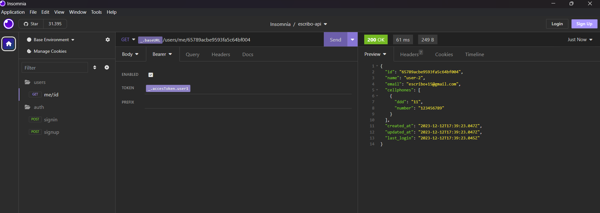
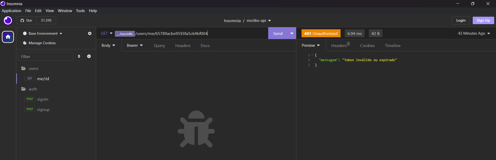
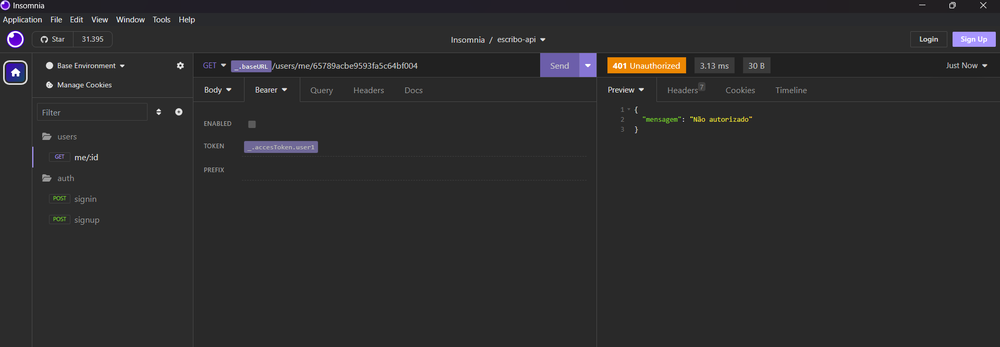

</h1>
   
<h1>Escribo - Processo Seletivo Node</h1> 

## Desafio

[Ver Projeto](https://escribo-processo-seletivo-node.vercel.app/)

### Objetivo:
Desenvolver uma API RESTful para autenticação de usuários, que permita operações de cadastro (sign up),
autenticação (sign in) e recuperação de informações do usuário.

Especificações Técnicas:

1. Formato de Comunicação:

- Todos os endpoints devem aceitar e retornar apenas dados no formato JSON.
- Retorno JSON para situações de endpoint não encontrado.

2. Persistência de Dados:

- Armazenamento persistente de dados do usuário.

3. Respostas de Erro:
- Formato padrão:

        { mensagem: mensagem de erro } 

### Endpoints:
#### 1. Sign Up (Criação de Cadastro):
- Input:

 

- Output (sucesso):

### Erros:
- E-mail já cadastrado: 
 
        { mensagem: E-mail já existente }

#### 2. Sign In (Autenticação):
- Input:

 

- Output (sucesso):

### Erros:
E-mail não cadastrado ou senha incorreta:

    { mensagem: Usuário e/ou senha inválidos }

Senha incorreta: status 401 com:

    { mensagem: Usuário e/ou senha inválidos } |

### 3. Buscar Usuário:
- Requisição: Header Authentication com valor Bearer {token}
 
### Erros:
- Token inválido: 
    
        { mensagem: Não autorizado }    

- Token expirado (mais de 30 minutos): 
  
        { mensagem: Sessão inválida }

### Requisitos:
- Persistência de dados.
- Sistema de build com gerenciamento de dependências.
- Task runner para build.
- Padronização de estilo (ex: jsHint/jsLint).
- Framework: Express, Hapi, ou similar.

### Requisitos Desejáveis:
- JWT como token.
- Testes unitários.
- Criptografia hash na senha e token.

### Submissão:
- Repositório no GitHub.
- Hospedagem: Heroku, Google Cloud, AWS, ou similar.

### Prazo:
- 72 horas
#

## Insomnia
 

#

### Rotas
- `POST: /auth/signin`
- `POST: /auth/signup`
- `GET: /users/me/:id`
- `BaseURL: https://escribo-processo-seletivo-node.vercel.app/`

#### signup
        {
            "name": "user-name",
            "email": "escribo+27@gmail.com",
            "password": "12223434",
            "cellphones": [
                {
                    "number": "123456789",
                    "ddd": "11"
                }
            ]
        }

#### signin

        {
            "email": "escribo+15@gmail.com",
            "password": "12345678"
        }

 

## 🛠️ Tecnologias

📁 **Back-end**
- [Node.js](https://nodejs.org)
- [Express.js](https://expressjs.com/pt-br/)
- [Prisma](https://www.prisma.io)
- [MongoDB](https://www.mongodb.com)
- [Mongoose](https://mongoosejs.com/docs/guide.html)
- [jsonwebtoken](https://jwt.io/)
- [zod](https://zod.dev/)
- [dotenv](https://www.npmjs.com/package/dotenv)

🔋 **Versionamento e Deploy**
- [Git](https://git-scm.com)
- [Vercel](https://vercel.com/)

 

⚙️ **Configuranções e Instalações**

Clone do Projeto

    $ git clone https://github.com/renovatt/escribo-processo-seletivo-node.git

Variáveis de ambiente

    PORT=
    JWT_SECRET=
    DATABASE_URL=

Instalando as dependências

    $ npm install

Iniciando o projeto

    $ npm run dev

 

**Como contribuir?**

- Você pode dar suporte me seguindo aqui no GitHub
- Dando uma estrela no projeto
- Criar uma conexão comigo no linkedin fazendo parte da minha networking e curtir o meu projeto.

 

**Autor**
[Wildemberg Renovato de Lima](https://www.linkedin.com/in/renovatt/)